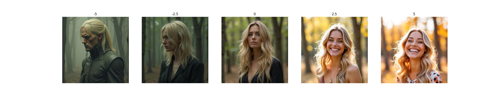

## flux sliders

修改自<https://github.com/rohitgandikota/sliders>

代码仍在快速迭代中，目标是兼容diffuers库，可以与现有flux生态整合。

### 安装环境

```bash
conda env create -f environment.yml
```

### 下载flux-dev模型

```bash
huggingface-cli login
huggingface-cli download --resume-download black-forest-labs/FLUX.1-dev --local-dir models/FLUX.1-dev
```

### 训练

直接执行以下命令，会训练人物由皱眉到微笑的sliders。

```bash
python train_text_sliders.py
```

### 推理

```bash
python predict.py
```

### 推理结果




更多的Sliders结果：

- [smile-sliders-flux-1d-lora](https://civitai.com/models/1230985/smile-sliders-flux-1d-lora)
- [age-sliders-flux-1d-lora](https://civitai.com/models/1242004/age-sliders-flux-1d-lora)
