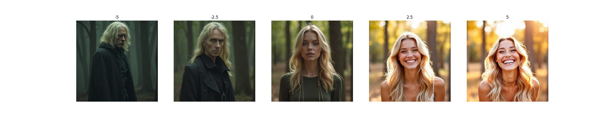

## flux sliders

修改自<https://github.com/rohitgandikota/sliders>

代码仍在快速迭代中，目标是兼容diffuers库，可以与现有flux生态整合。

### TODO

- [x] 支持diffusers直接推理
- [ ] 支持ComfyUI推理

### 安装环境

```bash
conda env create -f environment.yml
```

### 下载flux-dev模型

```bash
huggingface-cli login
huggingface-cli download --resume-download black-forest-labs/FLUX.1-dev --local-dir models/FLUX.1-dev
```

### 训练

直接执行以下命令，会训练人物由皱眉到微笑的sliders。

```bash
python train_text_sliders.py
```

### 推理

```bash
from datetime import datetime
from pathlib import Path

import torch
from diffusers import FluxPipeline

lora_path = "flux-age_sliders_latest.safetensors"
pipe = FluxPipeline.from_pretrained("models/FLUX.1-dev", torch_dtype=torch.bfloat16)
pipe.to("cuda")
pipe.load_lora_weights(lora_path)

time_stamp = datetime.strftime(datetime.now(), "%Y-%m-%d-%H-%M-%S")
save_dir = Path("outputs") / time_stamp
save_dir.mkdir(parents=True, exist_ok=True)

scales = (-5, -2.5, 0, 2.5, 5)
prompt = "female person"

for scale in scales:
    out = pipe(
        prompt=prompt,
        guidance_scale=3.5,
        height=512,
        width=512,
        num_inference_steps=25,
        joint_attention_kwargs={"scale": scale * 1 / 16},
        generator=torch.Generator().manual_seed(42),
    ).images[0]

    save_img_path = save_dir / f"{time_stamp}_scale_{scale}.jpg"
    out.save(save_img_path)
```

### 推理结果




更多的Sliders结果：

- [smile-sliders-flux-1d-lora](https://civitai.com/models/1230985/smile-sliders-flux-1d-lora)
- [age-sliders-flux-1d-lora](https://civitai.com/models/1242004/age-sliders-flux-1d-lora)
